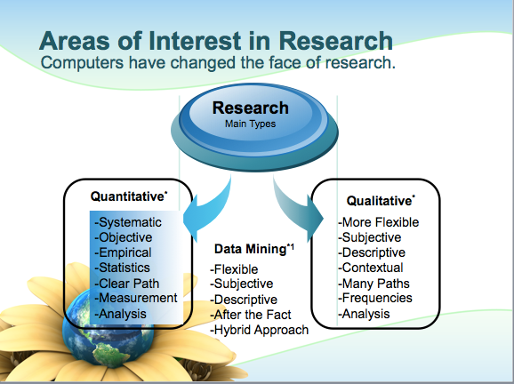
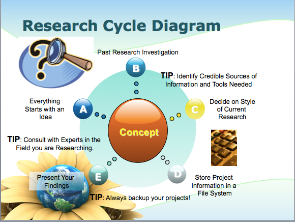
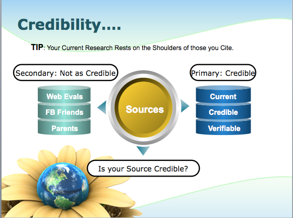

## Topics

1. Attendance
2. Goals
3. Computer Review
4. Math Review
5. The Scientific Method
6. Chapter 1
7. Next Week

## Goals for the Class

* __Primary Goal__

Understand the relationship between data and statistical analysis.

* __Relationship of Topics__

1. Everything is related in this course through concepts.
2. These concepts are applied to actual real world data to generate information. 
3. We want to increase the confidence in math, statistics, and the ability to understand information that is presented to you.

## Statistics

__Brief definition of Statistics:__

The subject of statistics deals with techniques for collecting, analyzing, and drawing conclusions from data. In science, or any subject, even psychology, you must know how to read the literature or how to interpret data. Statistics is your key, to knowing when you are given false data--or, for example, if that new medication really works.

Source: Statistical Methods, Eighth Edition by George W. Snedecor and William G. Cochran.

## Computer Review

During the course of the semester, you will be asked to be able to use the following programs as a minimum at a basic level: 

* MS Word or comparable program for Mac (i.e. Pages)
* MS Excel or comparable program for Mac (i.e. Numbers)
* SPSS Version 21

Computer labs are available on campus and via remote login

http://www.fullerton.edu/it/services/vcl/available_software.asp

## Additional Help for students

If you are stuck with a particular concept for the course or dealing with a computer, you can always try Google or emailing me. You are always welcome to visit me during office hours if you are still unsure about something related to the course. In addition, the University Learning Center is a great resource.

* Location: PLN 2nd floor

* Hours: Mon-Thu 9:00 a.m.-7:00 p.m.; Fri 9:00 a.m.-12:00 p.m.

* Services: The University Learning Center provides tutoring in select lower division, general education classes. The ULC is appointment-based, but walk-ins are taken based on tutor availability. Other services include supplemental instruction, conversation/pronunciation tutors, 
study groups, on-line writing tutors, academic success workshops, and academic support services for graduate students.

* Link: http://www.fullerton.edu/ulc/

* Phone: (657) 278-2738

## Word Problems? Not a problem.

In statistics we deal with word problems like this one:

Eleanor scores 680 on the Mathematics part of the SAT. The distribution of SAT scores in a reference population is Normal, with mean 500 and standard deviation 100. Gerald takes the American College Testing (ACT) Mathematics test and scores 27. ACT scores are Normally distributed with mean 18 and standard deviation 6. Assuming that both tests measure the same kind of ability, who did better?

* Source: http://ramnathv.github.io/user2014-idocs-slides/demos/widgets/quiz-all/#3

1. _Eleanor_

2. Gerald

This is a math question that asks you to take multiple components and use your math skills to solve the problem. In some cases, algebra is involved. 

### Explanation

The best way to compare their performance is to calculate their standardized scores.

$$z_E = \frac{680 - 500}{100} = 1.8$$

$$z_G = \frac{27 - 18}{6} = 1.5$$

Since, Eleanor has a higher standardized score, we can conclude that Eleanor did better!

## Math Review

In the problem on the slide before, we had to look at dealing with fractions and order of operations. Statistics is a math driven course, that means that the rules of math apply each time we work with a statistical concept to derive an answer. If you are concerned about math and want an easy refresher, this site is a great place to start:

Link: http://www.ixl.com/math/algebra-1

For now, we will look at some key concepts that should help you gain math confidence.

### Order of Operations

1. Parentheses and absolute value bars
2. Multiplication and division
3. Addition and subtraction

**Order of operations with rational numbers**

1. Multiplication and division
2. Addition and subtraction

### Helpful Tips 

As the class progresses on, look for more helpful math items and pay attention to the formulas presented. The math boot camp will run during my office hours during the second and third week. If you plan on attending, please let me know what topics you would like to cover. I will cover as many as I can during the time permitted. 

In addition, I will provide a detailed pdf or slides for the equations and topics covered in this class...including math concepts covered.

## The Scientific Method

A series of logical steps that, if followed, help minimize any distortion of facts stemming from the researcher's personal values and beliefs. 

Step                | Description
--------------------|----------------------------------------------
1. Purpose/Question | What do we want to learn
2. Research         | Evidence based
3. Hypothesis       | Educated guess (2 parts: null & alternative)
4. Experiment       | Test a procedure, idea, medication
5. Analysis         | Data
6. Conclusion       | Was your hypothesis correct

### The Scientific Method Continued

### The Scientific Method Continued

### The Scientific Method Continued

## Chapter 1

### Key Concepts: Types of Questions

Question Type  | Definition
---------------|-------------------------------------------
Empirical      | Questions pertaining to "what is"
Normative      | Questions pertaining to "what ought to be"

Both types of questions are of interest to researchers.

### Basic Science Terms

Term           | Definition
---------------|-------------------------------------------
Scientists     | People engaged in research.
Hypotheses     | Statements about phenomena being studied
Alt. Hypothesis| Statement of interest to investigate
Null Hypothesis| Counter statement of interest
Social Sciences| Empirical study of social phenomena 

### Basic Method Terms 

Term             | Definition
-----------------|------------------------------------------------
Cross-tabulation | Method of presenting data for testing
Concepts         | Ideas
Variables        | Concepts that vary or change
Deduction        | Process of reasoning from general to specific
Experiment       | Test of hypothesis: laboratory conditions
Scientific Law   | Hypotheses w/ high probability of being correct
Data             | Information used to verify a hypothesis
Datum            | Single data point (information)

### Relationship Terms

Term             | Definition
-----------------|----------------------------------------------------
Theory           | Set of interrelated hypotheses taken together explaining some phenomenon 
Main diagonal    | Diagonal line from upper left to lower right
Pos. Relationship| As one increases the other item increases
Off diagonal     | Clustering on a diagonal from upper right to the lower left
Inversely related| As one decreases the other item decreases
Cause            | One phenomenon being studied brings about the other
Temporal Sequence| One phenomenon being studied occurs earlier in time
Dependent Var.   | Variable being caused/explained
Independent Var. | Variable doing the explaining
Units of Analysis| What we actually measure or study 

## Quick Review Moment

In statistics we deal with many concepts:

True or False. Hypotheses are made up of a pair of statements that say the opposite thing. The statements are mutually exhaustive and mutually exclusive. 

1. _True_
2. False

### Hint

To look at testing something as true, you have to look at both sides of the story.

### Explanation

True. The answer is that it is made up of two components

$$H_0: Null Hypothesis$$

$$H_A: Alternative Hypothesis$$

              
## Next Week

* Math Bootcamp

* Brief Review

* Chapter 2

* Prepare for Homework 1 

## Bonus: Review what we covered

This is your section for writing notes. I hope you enjoy the material, I understand it is dense, but it has real world applications. Welcome to the wonderful world of statistics and your journey of learning.

### The Scientific Method

* Purpose/Question:

* Research: 

* Hypothesis: 

* Experiment: 

* Analysis:

* Conclusion

## Key concepts:

### Types of Questions

__Question Type __

* Empirical

* Normative 

* What fields do we see these types of questions in?

### Basic Terms

* Scientists     

* Hypotheses     

* Alternative Hypothesis

* Null Hypothesis

* Social Sciences 

* Cross-tabulation 

* Concepts         

* Variables        

* Deduction        

* Experiment       

* Scientific Law   

* Data             

* Datum            

* Theory           

* Main diagonal    

* Positive Relationship

* Off diagonal     

* Inversely Related

* Cause            

* Temporal Sequence

* Dependent Variable

* Independent Variable 

* Units of Analysis

* Statistics